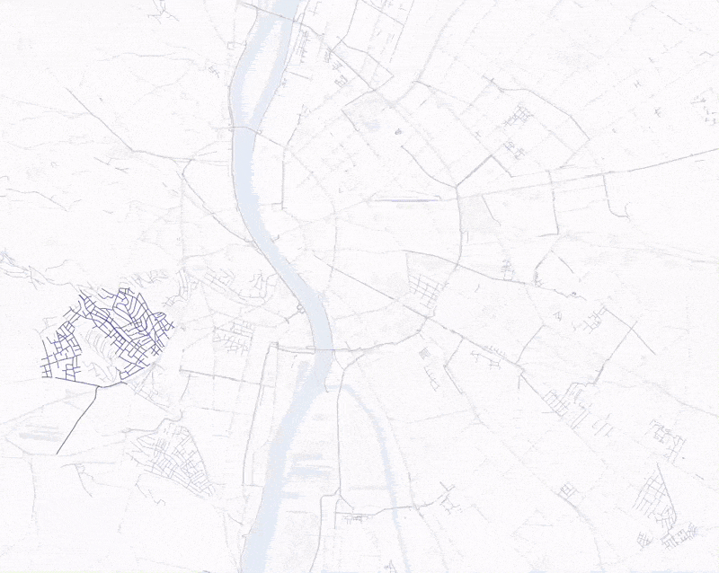

# <a href="https://docs.bikenetkit.org/LinkBikeNet/"></a>

[](https://pypi.org/project/LinkBikeNet/)
[](https://github.com/BikeNetKit/LinkBikeNet/actions/workflows/test.yml)

The Python package `linkbikenet` finds links between the disconnected components in a city's bicycle network. You can download street and bike network data with a single line of code, simulate different bicycle network linking scenarios, and export and plot the resulting prioritized linking steps.

[](https://bikenetkit.org/linkbikenet)

LinkBikeNet is a decision support tool for urban planners. It is also useful for proactive citizens to create a compelling vision for urban cycling in their city, and it aims to foster research on bicycle networks. 

## When to use
GrowBikeNet works well for cities that have some bicycle infrastructure in the form of disconnected components. This is the case for most cities in Europe. Recommended example cities to link components: Budapest, Dublin, Tirana

For alternative approaches, consider using [GrowBikeNet](https://github.com/BikeNetKit/GrowBikeNet) or [FixBikeNet](https://github.com/BikeNetKit/FixBikeNet).

## Installation

### The easy way

The currently default way to install LinkBikeNet is using pip:

```
pip install linkbikenet
```

## Usage
In development.

## Docs
In development.

## Source
The source code builds on [the code from the research paper](https://github.com/nateraluis/bicycle-network-growth) _Data-driven strategies for optimal bicycle network growth_.

**Publication**: [https://doi.org/10.1098/rsos.201130](https://doi.org/10.1098/rsos.201130)


## How to cite
If you use LinkBikeNet, please cite the paper:

> L.G. Natera Orozco, F. Battiston, G. Iñiguez, M. Szell. Data-driven strategies for optimal bicycle network growth. Royal Society Open Science 7:201130 (2020)
> DOI: [10.1098/rsos.201130](https://doi.org/10.1098/rsos.201130)

## Supported by
Development of BikeNetKit/LinkBikeNet is supported by the [Innovation Fund Denmark](https://innovationsfonden.dk/en) and the EU HORIZON project [JUST STREETS](https://www.just-streets.eu).

[](https://innovationsfonden.dk/en) &emsp;&emsp; [](https://commission.europa.eu/index_en) &ensp; [](https://www.just-streets.eu/) 
